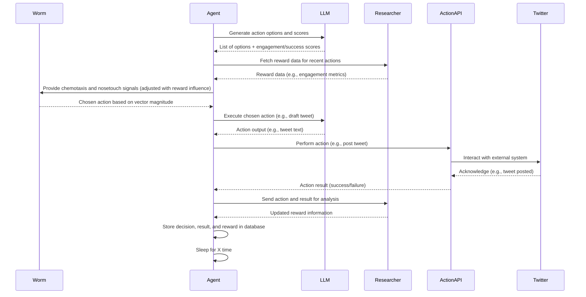

# eidos
RL Agentic Workflow Engine.

## Engine Cycle Overview

```mermaid
sequenceDiagram
    participant Worm
    participant Agent
    participant LLM
    participant Researcher
    participant ActionAPI
    participant Twitter

    Agent->>LLM: Generate action options and scores
    LLM-->>Agent: List of options + engagement/success scores
    Agent->>Researcher: Fetch reward data for recent actions
    Researcher-->>Agent: Reward data (e.g., engagement metrics)
    Agent->>Worm: Provide chemotaxis and nosetouch signals (adjusted with reward influence)
    Worm-->>Agent: Chosen action based on vector magnitude
    Agent->>LLM: Execute chosen action (e.g., draft tweet)
    LLM-->>Agent: Action output (e.g., tweet text)
    Agent->>ActionAPI: Perform action (e.g., post tweet)
    ActionAPI->>Twitter: Interact with external system
    Twitter-->>ActionAPI: Acknowledge (e.g., tweet posted)
    ActionAPI-->>Agent: Action result (success/failure)
    Agent->>Researcher: Send action and result for analysis
    Researcher-->>Agent: Updated reward information
    Agent->>Agent: Store decision, result, and reward in database
    Agent->>Agent: Sleep for X time
```